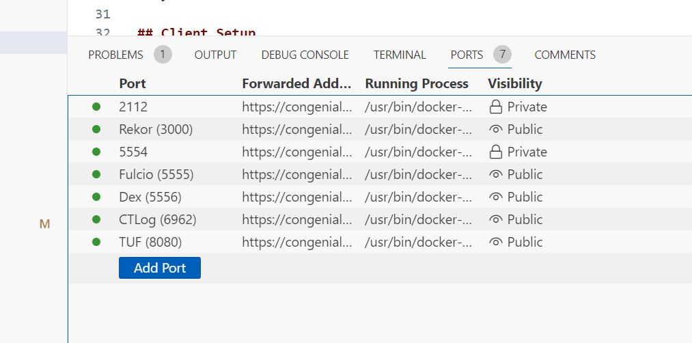

# Sigstore Testing Stack

This project is intended to stand up a working private sigstore stack, including Fulcio and Rekor, that is compatible with gitsign and cosign. Developers can use this to aid with deploying and testing their own sigstore stacks, as well as building integrations.

DISCLAIMER: This project is not intended to be a production ready instance. It's meant for learning only.

Sigstore is a complicated stack and this project leans heavily on the documentation and the examples found in the Scaffolding Project. Further reading can be found in the following locations:

* [Helm Charts](https://github.com/sigstore/helm-charts/tree/main)
* [Sigstore Scaffolding Project](https://github.com/sigstore/scaffolding)
* [Fulcio](https://github.com/sigstore/fulcio/tree/main)
* [Rekor](https://github.com/sigstore/rekor)
* [Dex](https://github.com/dexidp/dex)
* [Sigstore: Bring-your-own sTUF with TUF](https://blog.sigstore.dev/sigstore-bring-your-own-stuf-with-tuf-40febfd2badd/)

## Gitpod

[](https://gitpod.io/#https://github.com/ChevronTango/sigstore-testing-stack/)

This project was built with Gitpod in mind, and the quickest way for users to get started is to open a Gitpod workspace. Gitpod will automatically run the start scripts and initialise a fully working stack that users can integrate with their own systems.

When you open the workspace, Gitpod will run `docker compose up` which will initialize and run the scaffolding with all of the components needed.

`URL_PATTERN` is automatically set in the startup script however you may need to set it again in any future scripts you run.

## GitHub Codespaces

GitHub codespaces are also supported, however for it to work effectively, you will need to make sure that the ports are all public.



If you find that codespaces ports are not already public, you can change them yourself and then restart docker compose

```
docker compose restart
```

`URL_PATTERN` is automatically set in the startup script however you may need to set it again in any future scripts you run.

## Running Locally

I haven't done much testing locally, but I've tried to keep the majority of the hard work in docker containers where possible. In theory all you need to do is run the `docker compose up` script and the stack should stand up just the same as it would in Gitpod. The only difference is that the URLs and Dex Issuer will be at `localhost` instead of your Gitpod URL. If you need to set the URL as something else then you can use the `URL_PATTERN`.

## Client Setup

In order for your client to connect to your sigstore stack you need to do some basic configuration.

1. Install gitsign and cosign

```
brew tap sigstore/tap
brew install gitsign
brew install cosign
```

2. Configure your repo to sign commits using gitsign

```
git config --global commit.gpgsign true  # Sign all commits
git config --global tag.gpgsign true  # Sign all tags
git config --global gpg.x509.program gitsign  # Use Gitsign for signing
git config --global gpg.format x509  # Gitsign expects x509 args
```

3. Configure your gitsign to use your private instance. If you are in the same gitpod that is running your stack then the below commands will work. You may need to adjust them if you are running Sigstore in another location.

```
# Gitpod
git config --global gitsign.fulcio $(gp url 5555) # Private Fulcio
git config --global gitsign.rekor $(gp url 3000) # Private Rekor
git config --global gitsign.issuer $(gp url 5556) # Private Issuer

# Cosign initialization is only needed when doing verification. Can be skipped if the user is just doing signing.
cosign initialize --mirror=$(gp url 8080) --root=$(gp url 8080)/root.json
```

```
# GitHub Codespaces
git config --global gitsign.fulcio https://$CODESPACE_NAME-5555.app.github.dev # Private Fulcio
git config --global gitsign.rekor https://$CODESPACE_NAME-3000.app.github.dev # Private Rekor
git config --global gitsign.issuer https://$CODESPACE_NAME-5556.app.github.dev # Private Issuer

# Cosign initialization is only needed when doing verification. Can be skipped if the user is just doing signing.
cosign initialize --mirror=https://$CODESPACE_NAME-8080.app.github.dev --root=https://$CODESPACE_NAME-8080.app.github.dev/root.json
```

4. Make a signed Commit

```
git commit -m "Test" --allow-empty
```

5. Verify Your commit

```
# Gitpod
gitsign verify HEAD --certificate-identity kilgore@kilgore.trout --certificate-oidc-issuer $(gp url 5556)
```

```
# GitHub Codespaces
gitsign verify HEAD --certificate-identity kilgore@kilgore.trout --certificate-oidc-issuer https://$CODESPACE_NAME-5556.app.github.dev
```

If all went well then your commit will be verified and a record of it will be held in your private sigstore instance.

## TUF

TUF is a framework for proving that your Private Sigstore stack is genuine and hasn't been tampered with or intercepted. The Full details on it's implementation are complicated and this project won't delve into too much detail on how to customise it to use things like KMS keys, however the example herein should serve as a starting point for users wanting to get started with setting up a TUF trust store that works with Sigstore.

## Certs

Whilst many of the sigstore components can generate their own keys for testing, I have endeavoured to generate and expose them fully so that you can more easily see what is needed in your own setups. Things like Rekor needing an ECDSA backed cert are not obvious to most first time users, so the scripts herein are meant to help steer you to a working stack in your own Private instance.

## Init

A few of the components need to have certain config or certs generated first and passed to them. Rather than hard coding these, I elected to gerate these on the fly and expose them in the ./data directory to allow users to more easily see what the final result is.

## Dex

Dex acts as a Identity Provider to the Sigstore stack, and it's what users are redirected to when they need to sign a commit. To avoid complex integrations with GitHub IDPs or others I have chosen to only use the built in Mock provider to demonstrate Dex's capabilities whilst avoiding and integration work. Users can read through the Dex documentation if they require more complex federation in their own environment

NOTE: because of the mock IDP in DEX, all your commits will be signed by `kilgore@kilgore.trout`, which you will need to provide when doing any verification.
